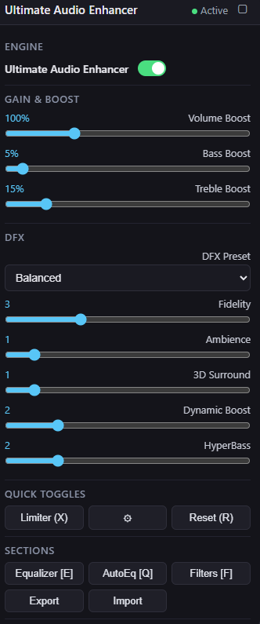
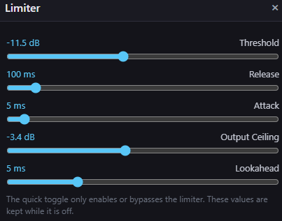
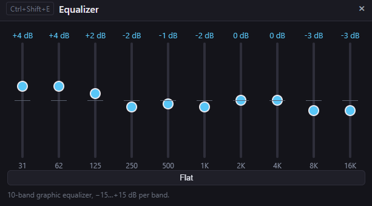
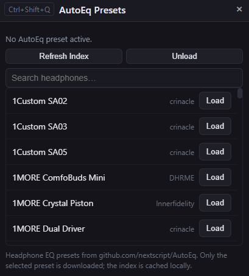
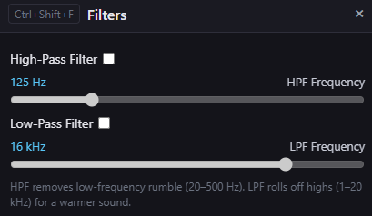

<a href="https://greasyfork.org/en/scripts/595277-ultimate-audio-enhancer?locale_override=1" target="_blank">Ultimate Audio Enhancer</a>

<h2>Make Every Video & Song Sound Better — Instantly</h2>

<b>Ultimate Audio Enhancer improves HTML5 audio and video in real time.</b> 
Boost bass and treble, tune a 10-band equalizer, apply AutoEq headphone profiles, add real-time effects, enhance stereo width, improve clarity and dynamics, and protect the output with a configurable limiter.

 

<b>No external audio software. No virtual audio cable. Just install the userscript and use the built-in controls.</b>

<h2>Why You Need This</h2>

<ul>
<li>Improve weak, flat, or unbalanced browser audio</li>
<li>Add stronger bass and clearer treble</li>
<li>Use a full 10-band graphic equalizer</li>
<li>Apply AutoEq headphone correction profiles</li>
<li>Add real-time effects such as echo, reverb, chorus, flanger, phaser, tremolo, vibrato, distortion, stereo delay, and convolution reverb</li>
<li>Enhance clarity, ambience, stereo width, dynamics, and low-end impact</li>
<li>Control high-pass and low-pass filtering</li>
<li>Increase playback volume beyond the normal 100% level</li>
<li>Protect boosted output with a configurable limiter</li>
<li>Keep one persistent audio setup across supported websites</li>
</ul>

<h2>Screenshots</h2>

<table>
  <tr>
    <td width="50%" align="center">
      
    </td>
    <td width="50%" align="center">
      
      
      
      
    </td>
  </tr>
</table>

<h2>Key Features</h2>

<ul>
<li><b>Real-time Web Audio processing</b> for HTML5 video and audio elements</li>
<li><b>Volume Boost</b> from 25% to 300%</li>
<li><b>Bass Boost</b> with low-shelf processing</li>
<li><b>Treble Boost</b> with high-shelf processing</li>
<li><b>10-band Equalizer</b> from 31 Hz to 16 kHz</li>
<li><b>AutoEq support</b> with searchable headphone presets</li>
<li><b>DFX enhancement</b> with five independent effects</li>
<li><b>Effects section</b> with real-time delay, reverb, modulation, distortion, compressor, and convolution effects</li>
<li><b>Effect Presets</b> with built-in presets and user presets</li>
<li><b>Drag-and-drop effect order</b> for changing the processing chain</li>
<li><b>High-Pass Filter</b> from 20–500 Hz</li>
<li><b>Low-Pass Filter</b> from 1–20 kHz</li>
<li><b>Configurable Limiter</b> with threshold, attack, release, ceiling, and lookahead</li>
<li><b>Import / Export</b> complete configurations as JSON</li>
<li><b>Persistent settings</b> using userscript storage</li>
<li><b>Movable overlay UI</b> with separate draggable settings windows</li>
<li><b>Keyboard shortcuts</b> for the most important controls</li>
</ul>

<h2>DFX Audio Enhancement</h2>

The DFX section adds five real-time enhancement controls:

<ul>
<li><b>Fidelity</b> → improves presence and high-frequency detail</li>
<li><b>Ambience</b> → adds a subtle spatial / room effect</li>
<li><b>3D Surround</b> → increases stereo width using Mid/Side processing</li>
<li><b>Dynamic Boost</b> → adds controlled compression and makeup gain for a stronger sound</li>
<li><b>HyperBass</b> → reinforces deep bass and low-frequency punch</li>
</ul>

Each DFX control ranges from <b>0 to 10</b> and is applied to the audio output in real time.

<h3>DFX Presets</h3>

<ul>
<li><b>Balanced</b> → moderate enhancement for general use</li>
<li><b>Music</b> → stronger clarity, dynamics, and bass</li>
<li><b>Cinema</b> → wider and more spacious movie sound</li>
<li><b>Gaming</b> → clear detail with increased stereo width</li>
<li><b>Vocal Clear</b> → prioritizes speech and vocal clarity</li>
<li><b>Bass Boost</b> → stronger low-end impact</li>
<li><b>Live</b> → increased ambience and spatial presentation</li>
<li><b>Night</b> → restrained enhancement for lower-volume listening</li>
<li><b>Power</b> → aggressive dynamics, bass, and stereo enhancement</li>
<li><b>Natural</b> → light processing with a more neutral presentation</li>
<li><b>Custom</b> → automatically selected when DFX values are changed manually</li>
</ul>

<h2>Effects</h2>

The Effects section adds an additional real-time effect chain to the audio pipeline.

<ul>
<li><b>Echo / Delay</b></li>
<li><b>Reverb / Hall</b></li>
<li><b>Pitch Shift</b></li>
<li><b>Chorus</b></li>
<li><b>Flanger</b></li>
<li><b>Phaser</b></li>
<li><b>Tremolo</b></li>
<li><b>Vibrato</b></li>
<li><b>Distortion / Overdrive</b></li>
<li><b>Compressor</b></li>
<li><b>Stereo Delay</b></li>
<li><b>Convolution Reverb</b></li>
</ul>

Each effect has its own on/off switch, configuration panel, and reset button. Multiple effects can run at the same time.

<h3>Effect Presets</h3>

<ul>
<li>Built-in presets such as Small Room, Large Hall, Cathedral, Slapback Echo, Deep Echo, Wide Chorus, Dreamy, Telephone, Radio, Megaphone, Lo-Fi, Vocal Wide, and Concert</li>
<li>Save, rename, delete, export, and import custom effect presets</li>
<li>Drag effects to change the processing order</li>
<li>Effect settings, order, selected preset, user presets, and modal position are saved automatically</li>
<li>Presets that temporarily change global settings, such as EQ or filters, restore the previous values when Reset All Effects or Custom is selected</li>
</ul>

<h2>10-Band Equalizer</h2>

<b>31 Hz · 62 Hz · 125 Hz · 250 Hz · 500 Hz · 1 kHz · 2 kHz · 4 kHz · 8 kHz · 16 kHz</b>

<ul>
<li>Gain range: <b>-15 dB to +15 dB</b> per band</li>
<li>Changes are applied immediately</li>
<li>Use <b>Flat</b> to reset every band to 0 dB</li>
</ul>

<h2>AutoEq Support</h2>

Ultimate Audio Enhancer can load headphone correction profiles from the AutoEq database.

<ul>
<li>Load the AutoEq preset index directly from GitHub</li>
<li>Search available headphone profiles</li>
<li>Download ParametricEQ profiles automatically</li>
<li>Convert parametric AutoEq filters to the built-in 10-band graphic equalizer</li>
<li>Automatically update the visible Equalizer sliders</li>
<li>Cache the selected profile locally</li>
</ul>

AutoEq data source:
<a href="https://github.com/nextscript/AutoEq" target="_blank">nextscript/AutoEq</a>

<h2>Filters</h2>

<h3>High-Pass Filter</h3>

Removes very low-frequency content such as rumble or excessive sub-bass.

<ul>
<li>Frequency range: <b>20–500 Hz</b></li>
<li>Can be enabled or disabled independently</li>
</ul>

<h3>Low-Pass Filter</h3>

Reduces high-frequency content for a softer or warmer sound.

<ul>
<li>Frequency range: <b>1–20 kHz</b></li>
<li>Can be enabled or disabled independently</li>
</ul>

<h2>Limiter</h2>

The built-in limiter helps control excessive output levels when using high boost values.

<ul>
<li><b>Threshold:</b> -20 to 0 dB</li>
<li><b>Attack:</b> 0.1 to 100 ms</li>
<li><b>Release:</b> 10 to 1000 ms</li>
<li><b>Output Ceiling:</b> -6 to 0 dB</li>
<li><b>Lookahead:</b> 0 to 20 ms</li>
<li>Quickly enable or bypass the limiter without losing its settings</li>
</ul>

⚠️ <b>Important:</b> High volume and strong boost settings can still produce uncomfortable listening levels. Start with moderate values and increase them carefully.

<h2>Keyboard Shortcuts</h2>

<b>All main shortcuts use CTRL + SHIFT + key.</b>

<table>
  <thead>
    <tr>
      <th align="left">Shortcut</th>
      <th align="left">Action</th>
    </tr>
  </thead>
  <tbody>
    <tr><td><b>CTRL + SHIFT + A</b></td><td>Show / hide Ultimate Audio Enhancer</td></tr>
    <tr><td><b>CTRL + SHIFT + E</b></td><td>Open Equalizer</td></tr>
    <tr><td><b>CTRL + SHIFT + Q</b></td><td>Open AutoEq Presets</td></tr>
    <tr><td><b>CTRL + SHIFT + F</b></td><td>Open High-Pass / Low-Pass Filter settings</td></tr>
    <tr><td><b>CTRL + SHIFT + S</b></td><td>Open Effects</td></tr>
    <tr><td><b>CTRL + SHIFT + B</b></td><td>Toggle Bass Boost</td></tr>
    <tr><td><b>CTRL + SHIFT + T</b></td><td>Toggle Treble Boost</td></tr>
    <tr><td><b>CTRL + SHIFT + L</b></td><td>Toggle High-Pass Filter</td></tr>
    <tr><td><b>CTRL + SHIFT + X</b></td><td>Toggle Limiter</td></tr>
    <tr><td><b>CTRL + SHIFT + R</b></td><td>Reset audio settings</td></tr>
    <tr><td><b>ESC</b></td><td>Close the active settings window</td></tr>
  </tbody>
</table>

<h2>Import / Export</h2>

<ul>
<li>Export current audio settings</li>
<li>Export overlay position and UI state</li>
<li>Import a previously saved configuration</li>
<li>Export and import individual effect presets</li>
<li>Imported values are validated before being applied</li>
</ul>

Default export filename: <code>ultimate-audio-enhancer-config.json</code>

<h2>Quick Start</h2>

<ul>
<li>Install Tampermonkey or another compatible userscript manager</li>
<li>Install the Ultimate Audio Enhancer userscript</li>
<li>Open a website containing HTML5 video or audio</li>
<li>Start playback</li>
<li>Press <b>CTRL + SHIFT + A</b></li>
<li>Adjust Bass, Treble, Equalizer, DFX, AutoEq, Effects, Filters, or Limiter</li>
<li>Done ✅</li>
</ul>

<h2>How It Works</h2>

Ultimate Audio Enhancer uses the browser's <b>Web Audio API</b> and routes supported HTML5 media through a real-time processing chain.

The processing chain includes volume control, filtering, equalization, DFX processing, stereo Mid/Side enhancement, the Effects chain, dynamic processing, limiting, and final output analysis.

Changes are applied while the media is playing, so adjustments are audible immediately.

<h2>Compatibility</h2>

<table>
  <thead>
    <tr>
      <th align="left">Feature</th>
      <th align="center">Chrome</th>
      <th align="center">Edge</th>
      <th align="center">Firefox</th>
      <th align="center">Opera</th>
    </tr>
  </thead>
  <tbody>
    <tr><td>HTML5 audio/video detection</td><td align="center">✅</td><td align="center">✅</td><td align="center">✅</td><td align="center">✅</td></tr>
    <tr><td>Web Audio processing</td><td align="center">✅</td><td align="center">✅</td><td align="center">✅</td><td align="center">✅</td></tr>
    <tr><td>Equalizer / DFX / Effects / Filters</td><td align="center">✅</td><td align="center">✅</td><td align="center">✅</td><td align="center">✅</td></tr>
    <tr><td>Keyboard shortcuts</td><td align="center">✅</td><td align="center">✅</td><td align="center">✅</td><td align="center">✅</td></tr>
  </tbody>
</table>

<h2>Important — Chrome / Edge</h2>

If userscripts do not run correctly, make sure userscript execution is enabled for your browser and userscript manager.

<ul>
<li>Enable Developer Mode in the browser extension settings if required</li>
<li>Make sure Tampermonkey is allowed to execute userscripts</li>
<li>Reload the website after installing or updating the script</li>
</ul>

<a href="https://www.tampermonkey.net/" target="_blank">Tampermonkey</a>

<h2>Technical Details</h2>

<ul>
<li>Userscript version: <b>1.0.3</b></li>
<li>Audio engine: <b>Web Audio API / AudioContext</b></li>
<li>Equalizer: <b>10 × BiquadFilterNode</b></li>
<li>Effects: <b>DelayNode, ConvolverNode, WaveShaperNode, BiquadFilterNode, ChannelSplitterNode, ChannelMergerNode, and DynamicsCompressorNode</b></li>
<li>Stereo enhancement: <b>Mid/Side processing</b></li>
<li>Dynamic processing: <b>DynamicsCompressorNode</b></li>
<li>Limiter: <b>Dynamics compressor + lookahead delay + output ceiling</b></li>
<li>Media detection: <b>MutationObserver + HTML5 media scanning</b></li>
<li>Settings storage: <b>GM_getValue / GM_setValue</b> with localStorage fallback</li>
<li>AutoEq download: <b>GM_xmlhttpRequest</b> with Fetch API fallback</li>
</ul>

